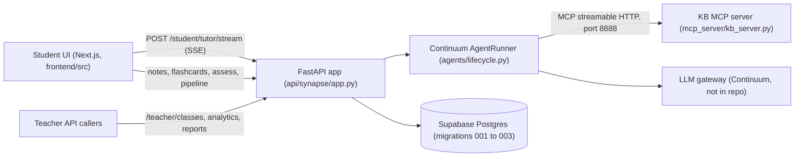

# Synapse AI

Synapse AI is a study assistant for students, with a classroom API for teachers. It runs on a FastAPI backend, a Next.js frontend and an AI agent runtime.

Won the AgentShyft Hackathon (May 2026).

## Why it matters

Students get personal study help: a tutor that checks understanding as it explains, notes and flashcards on demand, and quizzes aimed at their weakest topics. Teachers get a view of how the class is doing, so the generated material stays under their oversight.

## What it does

**Student side**

- Join a class with a class code.
- Chat with an AI tutor on a topic. The reply streams over server-sent events. The tutor inserts comprehension checks between key ideas.
- Generate smart notes and flashcards for a topic.
- Take a diagnostic quiz on the classroom topics. The student's weakest topics are picked first. Answers update a knowledge map.
- Take an assessment on a topic. The grader scores it and updates the knowledge map.

**Teacher side (API)**

- Create a class, upload a syllabus, enroll students.
- Invite one specific student by user ID. The invite has a code.
- Attach material links (title and URL). No file upload.
- View cohort analytics: average level per topic and a list of struggling topics.
- Get a JSON progress report for a class. PDF export is not built.

## How it works



- **Agents.** `api/synapse/agents/` holds the agent definitions. `tutor.py` streams the tutor reply. `diagnostic.py` writes the quiz. `assessment.py` generates and grades assessments. `notes.py` and `flashcards.py` write study material. `material_pipeline.py` runs notes and flashcards in parallel for each topic, with a ScatterAgent and a structured merge.
- **Runtime.** `agents/lifecycle.py` starts one shared runtime. It loads the ShyftLabs Continuum package and connects to the MCP server at startup. Continuum is not in this repo.
- **MCP server.** `mcp_server/kb_server.py` is a FastMCP server named `synapse-kb`. It exposes five tools: `ingest_syllabus`, `search_source_material`, `get_topic_sources`, `list_topics` and `get_student_syllabus`. Search counts shared words between the query and each chunk. It does not use embeddings. The corpus is hard-coded: 6 topics and 21 text chunks.
- **Streaming.** `routers/student/tutor.py` sends `start`, `content`, `check`, `tool`, `done` and `error` events. `agents/tutor.py` finds the `<<CHECK>>` blocks in the model output and sends them as `check` events.
- **Memory.** Agents set a memory scope (USER or CONVERSATION) in `agents/lifecycle.py`. The memory backend is configured in Continuum, not in this repo.
- **Knowledge map.** The evaluator in `routers/student/diagnose.py` and the grader in `routers/student/assess.py` update the `knowledge_maps` table.
- **Teacher and classroom APIs.** `routers/teacher/classes.py` handles classes, syllabus, enrollment, invites and materials. `routers/teacher/analytics.py` and `routers/teacher/reports.py` handle cohort analytics and the summary. `routers/student/classroom.py` handles invites and the knowledge-gap start.
- **Database.** `db/client.py` makes a Supabase client. The queries are in `db/student/queries.py` and `db/teacher/queries.py`. The SQL files are in `api/synapse/migrations/`. There is no migration runner. The SQL is applied by hand.

## Tech stack

Backend (`api/`): Python 3.11 or later, FastAPI, Pydantic, Supabase Python client, MCP Python SDK (`mcp.server.fastmcp`), ShyftLabs Continuum (not in repo).

Frontend (`frontend/src/`, root `package.json`): Next.js 16.2.6 (App Router), React 19.2.4, TypeScript, Tailwind CSS v4, lucide-react, zustand.

Earlier Flux prototype (`backend/src/`): Prisma with SQLite, tesseract.js (OCR), pdf2json, mammoth (DOCX), ElevenLabs SDK (audio).

## Run it

The frontend builds and runs from a clean clone (tested with Node 22):

```bash
git clone https://github.com/PATELOM925/Synapse-AI.git
cd Synapse-AI
npm ci
npm run build
npm run start -- -p 3100     # pages /, /student, /teacher and /dashboard
```

The knowledge-base MCP server also runs on its own:

```bash
cd api
KB_SERVER_PORT=8888 python -m synapse.mcp_server.kb_server
```

The FastAPI backend needs the ShyftLabs Continuum agent runtime, which is not in this repo, plus a Supabase project.

Environment variable names read by the code:

- Synapse API: `SUPABASE_URL`, `SUPABASE_SERVICE_ROLE_KEY`, `SUPABASE_ANON_KEY`, `KB_MCP_URL` (optional), `KB_SERVER_PORT` (optional).
- Synapse frontend: `NEXT_PUBLIC_API_URL` (optional, default `http://localhost:8000`).

## Team and roles

- **Awais Aziz.** Backend core. Created 40 of the 42 files under `api/`. This includes the agent runtime (`agents/lifecycle.py`), the agents, the MCP server, the tutor stream, the scatter pipeline, the models and the student routers. Also created the typed API client `frontend/src/lib/synapseApi.ts`.
- **Om Patel.** Teacher and classroom flow. The commit "teacher flow added" adds the invite and material migration, the student classroom router (invites, accept, knowledge-gap start), and the teacher invite and material endpoints.
- **Aman Shah.** Frontend. Created 50 of the 51 files under `frontend/src/`, including the landing page, the student and teacher pages, and the Flux dashboard and its helpers in `backend/src/`.

## Status and limits

This is a hackathon build. It is not production software.

- The backend depends on the Continuum runtime, so it does not start from a clean clone.
- The knowledge base is a small hard-coded corpus (6 topics, 21 chunks). Search is word overlap, not embeddings.
- The teacher screens in the UI show sample data. The teacher and classroom API exists but the UI does not call it yet.
- There is no login. API routes trust the IDs they receive.
- Materials are stored as a title and a link. Audio and video are not processed.
- No automated tests.
- The repo also holds an earlier prototype, Flux (`/dashboard`, Prisma and SQLite), next to Synapse (`/student`, `/teacher`, FastAPI and Supabase).

## Links

- Portfolio write-up: https://iampatelom.com/projects/synapse-ai
